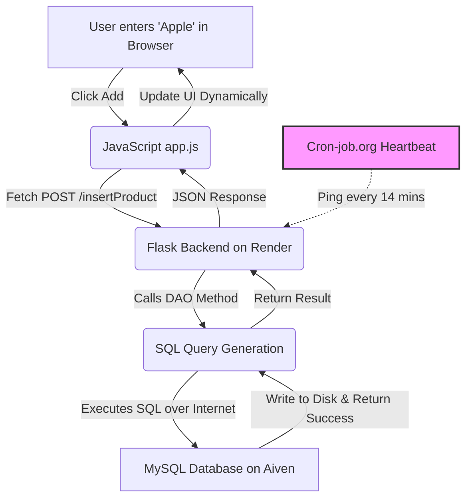

# Architecture and Data Flow Guide

This document explains the technical "behind-the-scenes" of the Grocery Store Management System. It covers how the application is structured, where your data lives, and exactly what happens step-by-step when a user interacts with the app.

---

## 1. High-Level Architecture (The 3-Tier Model)

The application follows a standard **3-Tier Architecture**, which is the industry gold standard for building scalable web apps.

1.  **Presentation Tier (Frontend):** The user interface (HTML/CSS/JS) running in the user's browser.
2.  **Logic Tier (Backend):** The Python Flask server running on **Render**.
3.  **Data Tier (Database):** The MySQL database running on **Aiven Cloud**.
4.  **Availability Tier (Keep-Alive):** A secondary service (**Cron-job.org**) that pings Render every 14 minutes to prevent the free tier from "sleeping."

---

## 2. Where is the Data Stored?

After deployment, your application is "Stateless." This means the web server (Render) doesn't keep any permanent memory.

*   **Render (The Brain):** Stores your code and logic. If Render restarts, your code stays, but any temporary "files" would be wiped.
*   **Aiven (The Memory):** Stores your actual data (Products, Orders, Prices). Even if you delete your Render service and create a new one, your data in Aiven remains perfectly safe.
*   **Cron-job.org (The Heartbeat):** It doesn't store data, but it keeps the "Brain" (Render) from going to sleep.

---

## 3. The Life of a Product (Step-by-Step Data Flow)

(Steps 1-6 remain the same...)

---

## 4. End-to-End Visualized Flow

---

## 5. Security: Environment Variables

To keep your Aiven database safe, we **never** hardcode the password in our code. Instead, we use **Environment Variables**.
*   When the Flask app starts on Render, it looks for a variable called `DB_PASSWORD`.
*   It uses this secret key to "unlock" the connection to Aiven.
*   This ensures that even if someone sees your code on GitHub, they cannot access your private customer data!

---

## 6. Conclusion
This architecture makes your Grocery Store system professional, secure, and ready for real-world use. By using Render and Aiven together, you have built a cloud-native application that follows the same patterns used by companies like Amazon and Netflix!
