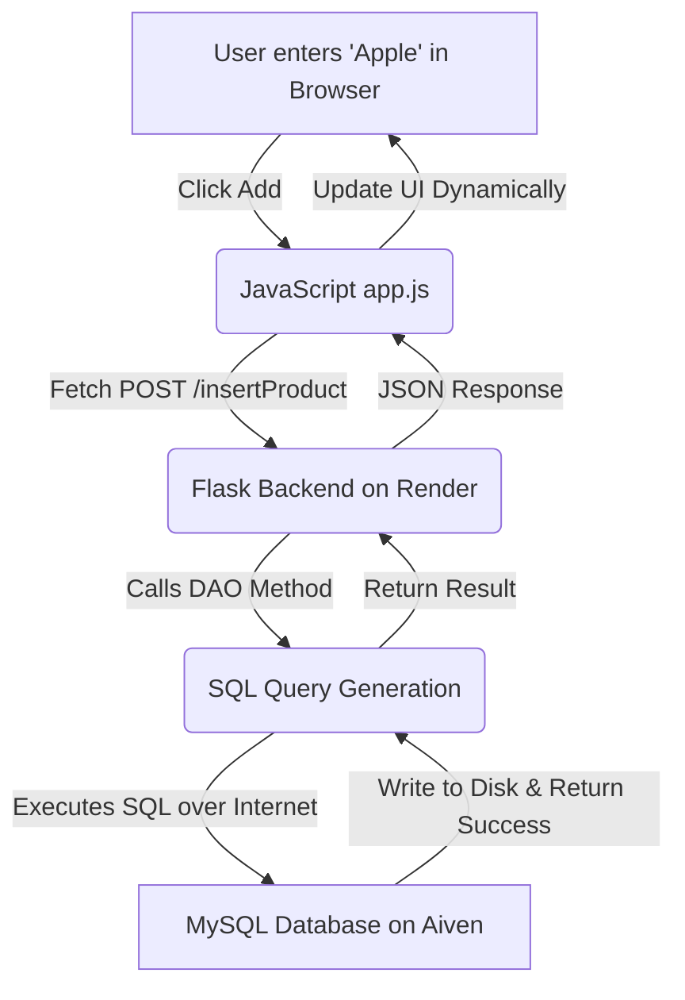

# Architecture and Data Flow Guide

This document explains the technical "behind-the-scenes" of the Grocery Store Management System. It covers how the application is structured, where your data lives, and exactly what happens step-by-step when a user interacts with the app.

---

## 1. High-Level Architecture (The 3-Tier Model)

The application follows a standard **3-Tier Architecture**, which is the industry gold standard for building scalable web apps.

1.  **Presentation Tier (Frontend):** The user interface (HTML/CSS/JS) running in the user's browser.
2.  **Logic Tier (Backend):** The Python Flask server running on **Render**.
3.  **Data Tier (Database):** The MySQL database running on **Aiven Cloud**.

---

## 2. Where is the Data Stored?

After deployment, your application is "Stateless." This means the web server (Render) doesn't keep any permanent memory.

*   **Render (The Brain):** Stores your code and logic. If Render restarts, your code stays, but any temporary "files" would be wiped.
*   **Aiven (The Memory):** Stores your actual data (Products, Orders, Prices). Even if you delete your Render service and create a new one, your data in Aiven remains perfectly safe.

**Why separate them?**
By separating the "Brain" from the "Memory," we ensure that we can update the code without ever risking the loss of a single customer order. This is called **Decoupling**.

---

## 3. The Life of a Product (Step-by-Step Data Flow)

What happens when you type "Apple" and click **"Add Product"**? Here is the journey of that data from start to finish:

### Step 1: The Browser (Frontend)
The user fills out the form in `index.html`. When they click "Add Product," a JavaScript function in `app.js` captures that text. It packages the data into a **JSON object**:
```json
{
  "product_name": "Apple",
  "unit_id": 1,
  "price_per_unit": 50
}
```

### Step 2: The Network Call (API Request)
JavaScript uses the **Fetch API** to send an asynchronous `POST` request over the internet to your Render URL (e.g., `https://grocery-app.onrender.com/insertProduct`).

### Step 3: The Web Server (Flask Backend)
The Flask server on Render receives the request. The route `@app.route('/insertProduct')` triggers. Flask extracts the JSON and passes it to the **DAO (Data Access Object)** layer (`products_dao.py`).

### Step 4: The Database Handshake (SQL)
The DAO takes the Python dictionary and turns it into a structured **SQL Query**:
```sql
INSERT INTO products (name, unit_id, price_per_unit) VALUES ('Apple', 1, 50);
```
Flask opens a secure tunnel to your **Aiven Cloud Database** and executes this command.

### Step 5: Persistence (Aiven)
The MySQL engine in the cloud receives the query, checks if the data is valid, and writes it onto the physical disk in the Aiven data center. It generates a unique `product_id` and sends a "Success" signal back to Flask.

### Step 6: The Full Circle (UI Update)
Flask receives the success signal, closes the database connection, and sends a JSON response back to the user's browser. The JavaScript on the page sees the "Success," clears the form, and refreshes the product list automatically.

---

## 4. End-to-End Visualized Flow



---

## 5. Security: Environment Variables

To keep your Aiven database safe, we **never** hardcode the password in our code. Instead, we use **Environment Variables**.
*   When the Flask app starts on Render, it looks for a variable called `DB_PASSWORD`.
*   It uses this secret key to "unlock" the connection to Aiven.
*   This ensures that even if someone sees your code on GitHub, they cannot access your private customer data!

---

## 6. Conclusion
This architecture makes your Grocery Store system professional, secure, and ready for real-world use. By using Render and Aiven together, you have built a cloud-native application that follows the same patterns used by companies like Amazon and Netflix!
